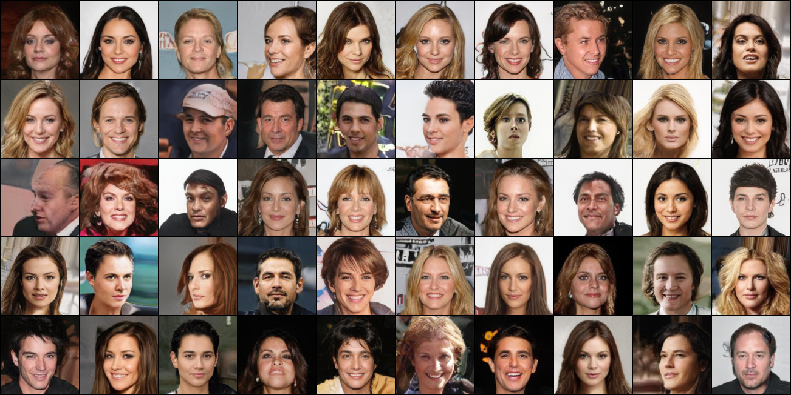
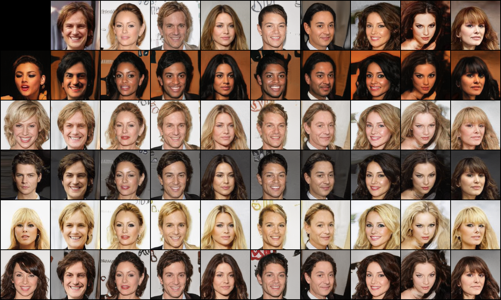

# Style-Based GAN in PyTorch

Implementation of A Style-Based Generator Architecture for Generative Adversarial Networks (https://arxiv.org/abs/1812.04948) in PyTorch

Usage:

> python train.py --mixing -d {folder} PATH

> python train.py --mixing --loss r1 --sched -d {folder}

## Sample

I have mixed styles at 4^2 - 8^2 scale. I can't get samples as dramatic as samles in the original paper. I think my model too dependent on 4^2 scale features - it seems like that much of details determined in that scale, so little variations can be acquired after it.